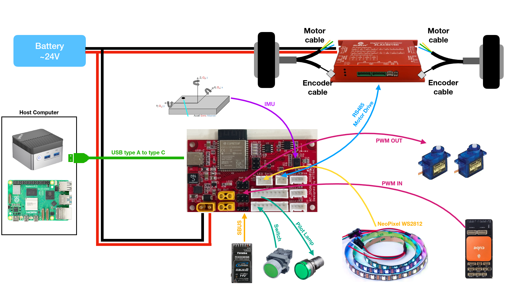

# AT_ZMOAB_ROS01 with Micro-ROS

A software to run on AT_ZMOAB_ROS01. It uses /dev/tty*** USB device for micro-ros interfaces with host computer.

## Functions

- drive brushless wheels motor ZLAC8015D
- SBUS parser
- 2 channels PWM Input
- 2 channels PWM Output
- 9 axes IMU BNO055
- NEOPixel LED strip
- GPIO interfaces (direct ESP32 GPIO)

## ROS2 Topics

No special message is used here, just std_msgs and sensor_msgs type.

| Topic Name           | Msg Type                      | PUB   | SUB   | Publish frequency                        | Definition                                                                                                                                                                                                                                                                                      | 
| :------------------: | :---------------------------: | :---: | :---: | :--------------------------------------: | :---------------------------------------------------------------------------------------------------------------------------------------------------------------------------------------------------------------------------------------------------------------------------------------------- | 
| /zmoab/cart_mode     | std_msg/msg/Int8              | ESP32 | PC    | continuous                               | cart mode  0=HOLD  1=MANUAL  2=AUTO                                                                                                                                                                                                                                                    | 
| /zmoab/encoder       | std_msg/msg/Int32MultiArray   | ESP32 | PC    | continuous                               | [left encoder, right encoder] Left: + forward - reverse Right: - forward + reverse                                                                                                                                                                                                        | 
| /zmoab/error         | std_msgs/msg/Int16MultiArray  | ESP32 | PC    | continuous                               | [left wheel error, right wheel error] NO_FAULT = 0 OVER_VOLT = 1 UNDER_VOLT = 2 OVER_CURR = 4 OVER_LOAD = 8 CURR_OUT_TOL = 16 ENCOD_OUT_TOL = 32 MOTOR_BAD = 64		REF_VOLT_ERROR = 128		EEPROM_ERROR = 256 HALL_ERROR = 512 HIGH_TEMP = 1024                       | 
| /zmoab/imu           | sensor_msgs/msg/Imu           | ESP32 | PC    | continuous                               | original IMU msg                                                                                                                                                                                                                                                                                | 
| /zmoab/pwm_in        | std_msgs/msg/Int16MultiArray  | ESP32 | PC    | continuous                               | [PWM IN 1, PWM IN 2]                                                                                                                                                                                                                                                                            | 
| /zmoab/rpm_fb        | std_msgs/msg/Int16MultiArray  | ESP32 | PC    | continuous                               | [left rpm, right rpm]                                                                                                                                                                                                                                                                           | 
| /zmoab/sbus_rc_ch    | std_msgs/msg/UInt16MultiArray | ESP32 | PC    | continuous                               | 16 channels SBUS value                                                                                                                                                                                                                                                                          | 
| /zmoab/switch        | std_msgs/msg/Int8MultiArray   | ESP32 | PC    | continuous                               | Switch value [sw1, sw2, sw3, sw4]                                                                                                                                                                                                                                                               | 
| /zmoab/cart_mode_cmd | std_msgs/msg/Int8             | PC    | ESP32 | one at a time                            | cart mode cmd 0=HOLD  1=MANUAL  2=AUTO                                                                                                                                                                                                                                                 | 
| /zmoab/disable_motor | std_msgs/msg/Bool             | PC    | ESP32 | one at a time                            | True : disable motor, release brake False : enable motor, engage brake                                                                                                                                                                                                                       | 
| /zmoab/imu_reset     | std_msgs/msg/Bool             | PC    | ESP32 | one at a time                            | Reset IMU data, this will cause agent connection at few seconds.                                                                                                                                                                                                                                | 
| /zmoab/led_state     | std_msgs/msg/Int8             | PC    | ESP32 | one at a time                            | 0 : LED OFF  1 : Solid red 2 : Solid green 3 : Solid blue  11 : Blink red 12 : Blink green 13: Blink blue  21 : Heartbeat red 22 : Heartbeat green 23 : Heartbeat blue  31 : Moving red 32 : Moving green 33 : Moving blue  100 : Rainbow | 
| /zmoab/rpm_cmd       | std_msgs/msg/Int16MultiArray  | PC    | ESP32 | continuous, after 1 seconds will be stop | [left rpm, right rpm]                                                                                                                                                                                                                                                                           | 
| /zmoab/servo_cmd     | std_msgs/msg/Int16MultiArray  | PC    | ESP32 | one at a time                            | [PWM OUT 1, PWM OUT 2]                                                                                                                                                                                                                                                                          | 

